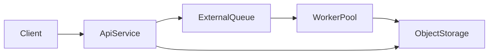

# Serverless containers

This page describes how to run DocTranslater on **managed container / serverless job** platforms (Cloud Run, ECS Fargate, App Runner, Modal, Runpod, etc.). It is **not** about edge runtimes (Workers, Lambda@Edge).

For image contents and build targets, see [Docker overview](docker.md) and [Docker image profiles](docker-profiles.md). For the optional HTTP API, see [HTTP API](http-api.md).

## Primary reference

**Google Cloud Run** is the recommended primary reference for OSS docs: single-container deploy, env-based config, and a good match for the `runtime-api` image. Step-by-step guide: [Deploy on Cloud Run](deploy-cloud-run.md).

When jobs exceed request timeouts or need heavier isolation, graduate to **ECS Fargate** workers or **Modal** functions—see [Deploy on Fargate and App Runner](deploy-fargate-app-runner.md) and the platform notes below.

## Platform comparison

| Platform | Fit | Native / large image | Cold start | Long jobs | Ephemeral disk | Notes |
|----------|-----|----------------------|------------|-----------|----------------|-------|
| **Google Cloud Run** | **Strong** | Supported; use warm image or startup warmup | Mitigate with min instances + warm cache | Bounded by **request timeout**; use workers for very long PDFs | Ephemeral; use object storage for durable artifacts | Primary OSS reference |
| **AWS ECS Fargate** | **Strong** | Full control over task CPU/RAM | Task cold start; scale with service + queue | **No hard platform request cap** like Cloud Run HTTP | Ephemeral task storage; EFS optional | Best for **worker** queues |
| **Modal** | **Strong** (workers) | Custom images / volumes | Good primitives for ML-style cold start | Fits async job pattern | Ephemeral; mount volumes or fetch artifacts | Great **burst worker**; less universal than Cloud Run for “drop-in API” |
| **AWS App Runner** | **Possible** | Similar to Fargate service | Autoscaling service | **Weaker** for long-running batch | Ephemeral | Prefer for **light API** or short jobs |
| **Runpod** | **Possible** | GPU-oriented | Pod startup | Long runs OK | Ephemeral / volume options | Use when **GPU** or pod-style execution fits |
| **AWS Lambda (container)** | **Poor** | 250 MB unzipped / 10 GB image limits; heavy ONNX stack is awkward | Cold start + size | **Hard max duration** (minutes) | Ephemeral | Appendix only—see [Lambda caveat](#aws-lambda-container-images-caveat) |

### Fit vs repository characteristics

- **Native-heavy stack** (ONNXRuntime, OpenCV, PyMuPDF, optional Hyperscan): prefer **Linux amd64/arm64** images from this repo’s `Dockerfile`; avoid exotic libc unless you rebuild.
- **Cold-start sensitivity**: layout ONNX and font caches dominate; use **`runtime-*-warm`** targets, **`DOCTRANSLATE_API_WARMUP_ON_STARTUP=eager`**, or `POST /v1/assets/warmup` before traffic; see [HTTP API – Production notes](http-api.md#serverless-and-multi-instance-behavior).
- **Large images**: acceptable on Cloud Run, Fargate, Modal, Runpod; Lambda container images are the outlier.
- **Model / asset warmup**: outbound HTTPS or [offline asset bundles](ai/verification.md); warm build stages need network at **image build** time. Runtime warmups: see [Docker – Quick start](docker.md#quick-start) (`assets warmup` and warm image targets).
- **Long-running jobs**: HTTP API jobs run **inside the container process**; platform **request timeouts** do not cancel background tasks on all platforms—still cap risk with `DOCTRANSLATE_API_JOB_TIMEOUT_SECONDS` and worker architectures.
- **Local disk**: treat as **scratch only**; persist outputs to **object storage** (S3, GCS, R2) for production.

## Recommended deployment modes

### Mode A — HTTP service (small / medium jobs)

- Image: **`runtime-api`** (`doctranslate serve`, port **8000**).
- Scale **replicas** horizontally; keep **one Uvicorn worker** per container (see [HTTP API](http-api.md)).
- Tune `DOCTRANSLATE_API_MAX_CONCURRENT_JOBS` (default `2`) to match memory.

### Mode B — Batch / worker (long or heavy jobs)

- Image: **`runtime-cpu`** or **`runtime-vision`** (no FastAPI unless you add a thin sidecar).
- Pull work from an **external queue** (SQS, Pub/Sub, Celery broker, Modal `.map`, etc.).
- Write **inputs/outputs to object storage**; use local disk only for temp IL/PDF work.

### Mode C — Split control plane + workers (recommended at scale)

- **Control plane**: small `runtime-api` (or serverless API gateway + minimal service) for `/v1/inspect`, `/v1/config/validate`, health, optional job **acceptance** that enqueues work only.
- **Data plane**: Fargate / Modal / Runpod workers run `doctranslate translate` or embed `doctranslate.api.async_translate`.

## Runtime envelopes (starting points)

Tune per document size and OCR flags; these are **documentation defaults**, not hard limits.

| Profile | vCPU | Memory | Startup budget | Timeout / duration |
|---------|------|--------|------------------|-------------------|
| HTTP service | 1–2 | 2–4 GiB | 20–45 s cold; 10–20 s with warm cache | Align **platform HTTP timeout** with largest expected **upload + poll**; set `DOCTRANSLATE_API_JOB_TIMEOUT_SECONDS` for safety |
| CPU worker | 2–4 | 4–8 GiB | 45–120 s for heavy cold pulls | Task / job runner limit (hours on Fargate) |
| Vision / OCR worker | 4+ | 8–16 GiB | 60–120 s | Same as worker |

**Filesystem**: ephemeral; mount a volume for `~/.cache/doctranslate` when the platform supports it (Cloud Run volumes, EFS on Fargate).

**Cache / models**: persist `HOME/.cache/doctranslate` (default user `doctranslater`, UID **1000**) or ship [offline assets](docker.md#quick-start) (`pack-offline` / `restore-offline`; see [Verification](ai/verification.md)).

## OSS surface (what this repo ships)

- **Docker images** — multi-target `Dockerfile` and GHCR publishes (see [Docker](docker.md)).
- **Reference HTTP API** — optional; not required for workers using the CLI or `doctranslate.api`.
- **Example manifests** — starter YAML under [Deploy samples](deploy-samples/README.md) (see per-platform guides).
- **Docs** — this page, [Cloud Run](deploy-cloud-run.md), [Fargate / App Runner](deploy-fargate-app-runner.md), [Runtime & image reference](serverless-runtime-reference.md).

## Operational checklist

- **Autoscaling**: scale replicas; avoid many Uvicorn workers per replica for memory-heavy ONNX + PDF work.
- **Concurrency**: lower `DOCTRANSLATE_API_MAX_CONCURRENT_JOBS` when OOM risk is high; combine with max instances / max tasks.
- **Isolation**: separate **inspect/config** traffic from **translate** workers when possible.
- **Observability**: ship container **stdout/stderr** to your platform logs; include **job_id** from API responses in client logs.
- **Startup / assets**: use `/v1/health/ready` with `DOCTRANSLATE_API_REQUIRE_ASSETS_READY=true` when you require a warmed cache before serving (see [HTTP API](http-api.md)).
- **Multi-instance HTTP API**: the in-process `JobManager` is **per replica**; clients must poll the **same** instance that accepted `202` **or** you must add an external job store—documented in [HTTP API](http-api.md#serverless-and-multi-instance-behavior).

## AWS Lambda container images (caveat)

Lambda’s **maximum execution time** (minutes) and packaging constraints conflict with long PDF pipelines and large native dependencies. DocTranslater does **not** target Lambda as a primary deployment.

If you experiment anyway: use the smallest possible extra set, **skip LLM** paths (e.g. `skip_translation` smoke only), aggressive memory, and accept frequent **cold starts**. Prefer **Fargate** or **Cloud Run** for real workloads.

## Related

- [Serverless runtime & image reference](serverless-runtime-reference.md) — env vars and image/workload matrix
- [Deploy on Cloud Run](deploy-cloud-run.md)
- [Deploy on Fargate and App Runner](deploy-fargate-app-runner.md)
- [Modal and Runpod notes](deploy-modal-runpod.md)

## Rollout phases (contributors)

PR-sized sequencing (mirrors the serverless deployment plan):

| Phase | Scope | Done when |
|-------|--------|-----------|
| 1 | Overview docs | [Serverless containers](serverless-containers.md) merged with platform matrix + architecture |
| 2 | Primary reference | [Deploy on Cloud Run](deploy-cloud-run.md) + [Cloud Run sample YAML](deploy-samples/cloud-run-service.sample.yaml) |
| 3 | Secondary platforms | [Fargate / App Runner](deploy-fargate-app-runner.md), [Modal / Runpod](deploy-modal-runpod.md), [ECS sample YAML](deploy-samples/ecs-taskdef-api.sample.yaml) |
| 4 | Runtime profiles | [Docker](docker.md), [Docker profiles](docker-profiles.md), [HTTP API](http-api.md) serverless sections + [runtime reference](serverless-runtime-reference.md) |
| 5 | CI | Docker workflow runs **API boot + health** and **CLI skip-translation** fixture smoke |
| 6 | Verify | `mkdocs build --strict` passes; cross-links and nav updated |

**Risks:** large cold-start downloads; OOM from high concurrency; multi-replica job polling without sticky sessions or external queue — mitigations are documented above and in the HTTP API page.
